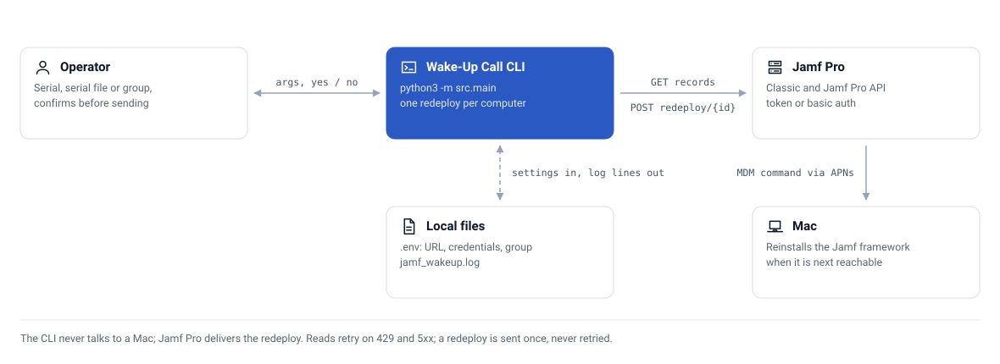

<div align="center">

# ⏰ Jamf Pro Wake-Up Call Script

**A Python utility to remotely wake up and redeploy the Jamf Management Framework on macOS computers in your Jamf Pro environment.**


</div>

---

> [!IMPORTANT]
> **Superseded.** The same wake-up / redeploy logic now lives in **[Jamf-SnipeIT-Suite](https://github.com/CaputoDavide93/Jamf-SnipeIT-Suite)** as the `wakeup` module (`src/modules/maintenance/wakeup.py`), with retries and SSM-backed credentials. Use that for new work — this repo is kept for reference and receives fixes only.

---

## 📖 Overview

This script provides an easy-to-use interface to send wake-up commands (MDM redeploy commands) to macOS computers managed by Jamf Pro. It supports three operational modes:

1. **Group Mode** - Wake up all computers in a dynamic group
2. **Single Mode** - Wake up a specific computer by serial number
3. **File Mode** - Wake up multiple computers from a serial number list

### Why Use This Script?

When Jamf Pro devices enter sleep state or go offline, management commands may queue indefinitely. This script:
- Sends immediate redeploy commands to wake up the Jamf Management Framework
- Processes multiple computers efficiently
- Supports automation with batch files
- Includes safety features (dry-run, confirmation prompts)
- Retries read-only API calls on throttling and server errors
- Provides detailed logging for troubleshooting

---

## 🗺️ How it works

<picture>
  <source media="(prefers-color-scheme: dark)" srcset="docs/assets/architecture-dark.svg">
  
</picture>

The script never talks to a Mac directly. It asks Jamf Pro to redeploy the management framework, and Jamf Pro delivers that as an MDM command the next time the Mac is reachable.

---

## ✨ Features

| | Feature | What it does |
|---|---|---|
| 🎯 | Multiple target modes | Entire dynamic groups, single serial, or batch from a serial-number file |
| 🛟 | Safety features | Interactive confirmation, dry-run preview, detailed logging, informative errors |
| 🔑 | Flexible authentication | Token-based (recommended) or username/password, with automatic token refresh |
| 🔁 | Resilient API calls | GETs retry up to 3 times with backoff on `429` / `5xx`; redeploy POSTs are never retried, so no command is sent twice |
| 🧱 | Placeholder guard | Values left unedited from `.env.example` are treated as unset, so the script never calls a fake tenant |
| 🧑‍💻 | User-friendly | Formatted console output, comments in batch files, skip-confirmation for automation |

---

## 🚀 Quick Start

### 1. Clone the Repository

```bash
git clone https://github.com/CaputoDavide93/Jamf_WakeUp_Call.git
cd Jamf_WakeUp_Call
```

### 2. Install Dependencies

```bash
pip install -r requirements.lock.txt     # pinned, hash-checked runtime deps
# or, for development (adds pytest):
pip install -r requirements-dev.txt
```

### 3. Configure Credentials

Create a `.env` file in the project directory:

```bash
cp .env.example .env
```

Edit `.env` with your Jamf Pro credentials:

```env
JAMF_PRO_URL=https://your-jamf-instance.jamfcloud.com
JAMF_PRO_USERNAME=your_username
JAMF_PRO_PASSWORD=your_password
JAMF_DYNAMIC_GROUP_ID=<GROUP_ID>

# Optional
LOG_LEVEL=INFO
LOG_FILE=jamf_wakeup.log
API_TIMEOUT=30
```

> **⚠️ Important:** `JAMF_PRO_URL` is required — the script exits with an error if it's unset or still the `.env.example` placeholder. Never commit `.env` files with real credentials; the `.gitignore` is already configured to prevent this.

---

## 📖 Usage

### Mode 1: Wake Up Entire Dynamic Group

Wake up all computers in your configured dynamic group (with confirmation):

```bash
python3 main.py
```

Preview without sending commands:

```bash
python3 main.py --dry-run
```

Skip confirmation (for automation):

```bash
python3 main.py --skip-confirmation
```

Target a different group:

```bash
python3 main.py --group-id 42
```

### Mode 2: Wake Up Single Computer

Wake up a specific computer by serial number:

```bash
python3 main.py C02XXXXXXXXX
```

Dry-run preview:

```bash
python3 main.py C02XXXXXXXXX --dry-run
```

### Mode 3: Wake Up Multiple Computers from File

Create a file with serial numbers (one per line):

```bash
cat > computers.txt << EOF
# Production Servers
C02XXXXXXXX1
C02XXXXXXXX2

# Development Machines
C02XXXXXXXX3
C02XXXXXXXX4
EOF
```

Wake up all computers in the file:

```bash
python3 main.py --file computers.txt
```

Preview first:

```bash
python3 main.py --file computers.txt --dry-run
```

### File Format (for --file mode)

- One serial number per line
- Lines starting with `#` are treated as comments
- Empty lines are ignored

```
# Team A Computers
C02XXXXXXXX1
C02XXXXXXXX2

# Team B Computers
C02XXXXXXXX3
C02XXXXXXXX4
```

### Command-Line Options

```
usage: main.py [-h] [--file FILE] [--group-id GROUP_ID] [--dry-run] 
               [--skip-confirmation] [serial]

Send wake-up calls to computers in Jamf Pro

positional arguments:
  serial                Computer serial number (e.g., C02XXXXXXXXX)

optional arguments:
  -h, --help            show help message
  --file FILE, -f FILE  File with serial numbers (one per line)
  --group-id ID         Dynamic group ID (overrides config)
  --dry-run             Show what would be done (no commands sent)
  --skip-confirmation   Skip confirmation prompt
```

### Output Examples

<details>
<summary><strong>Successful wake-up</strong></summary>

```
====================================================================================================
WAKE-UP COMMAND SENT
====================================================================================================
✓ Computer 101 (C02XXXXXXXXX)
  Device ID: 101
  Command UUID: 00000000-0000-0000-0000-000000000001
====================================================================================================
```

</details>

<details>
<summary><strong>Batch results</strong></summary>

```
====================================================================================================
WAKE-UP CAMPAIGN RESULTS
====================================================================================================
Total computers: 3
Successful: 2
Failed: 1
====================================================================================================

✓ Successfully sent wake-up commands to:
  ✓ Computer 101 (UUID: 00000000-0000-0000-0000-000000000002)
  ✓ Computer 102 (UUID: 00000000-0000-0000-0000-000000000003)

⚠️  Some computers failed:
  ✗ Computer 103: 500 Server Error
```

</details>

---

## ⚙️ Configuration

### Environment Variables

| Variable | Required | Description |
|----------|----------|-------------|
| `JAMF_PRO_URL` | Yes | Base URL of your Jamf Pro instance (no default — the script exits if unset) |
| `JAMF_PRO_USERNAME` | Yes* | Username for authentication |
| `JAMF_PRO_PASSWORD` | Yes* | Password for authentication |
| `JAMF_PRO_API_TOKEN` | Yes* | API Bearer token (alternative to username/password) |
| `JAMF_DYNAMIC_GROUP_ID` | No | Default group ID for group mode |
| `LOG_LEVEL` | No | Logging level (INFO, DEBUG, WARNING, ERROR) |
| `LOG_FILE` | No | Log file path |
| `API_TIMEOUT` | No | API request timeout in seconds |

*Either username/password OR API token is required.

Any value still starting with an `.env.example` placeholder (`your_`, `your-`, `dev_`, `https://your-`) is treated as missing.

---

## 🛠️ Troubleshooting

### 401 Unauthorized Error

**Problem:** The script returns a 401 Unauthorized error.

**Solution:**
- Verify your credentials in `.env` are correct
- Ensure your Jamf Pro user has API access permissions
- Check that the account is not locked or disabled

### Computer Not Found

**Problem:** Serial number doesn't match any computer in Jamf Pro.

**Solution:**
- Verify the serial number is correct
- Check that the computer is enrolled in Jamf Pro
- Use `--dry-run` to preview before executing

### Connection Refused

**Problem:** Cannot connect to Jamf Pro server.

**Solution:**
- Verify `JAMF_PRO_URL` is correct and reachable
- Check internet connectivity
- Ensure there are no firewall rules blocking the connection

### 429 Too Many Requests / 5xx

Read requests are retried automatically (3 attempts, exponential backoff). If a run still fails, wait a few minutes and re-run (use `--dry-run` first to confirm the targets).

### Logging

All operations are logged to the file specified in `LOG_FILE` (default: `jamf_wakeup.log`):

```bash
tail -f jamf_wakeup.log
```

Set `LOG_LEVEL=DEBUG` in `.env` for detailed troubleshooting information.

---

## 🔒 Security

**Best Practices:**

1. **Never commit `.env` files** - Already prevented by `.gitignore`
2. **Use strong passwords** - Store securely
3. **Limit API permissions** - Give Jamf Pro user minimal required permissions
4. **Review logs regularly** - Monitor what commands are being executed
5. **Use `--dry-run` first** - Always preview before execution
6. **Implement confirmation prompts** - Default behavior includes confirmation

---

## 📁 Repo structure

```text
Jamf_WakeUp_Call/
├── main.py              # 🎛️ main script with CLI and orchestration
├── jamf_client.py       # 🔌 Jamf Pro API client
├── config.py            # ⚙️ configuration management
├── requirements.txt     # 📜 runtime dependency ranges
├── requirements.lock.txt # 🔒 pinned, hashed runtime lockfile (uv pip compile)
├── requirements-dev.txt # 🧪 dev extras (pytest)
├── tests/               # ✅ pytest suite (config placeholders, diagrams)
├── tools/               # 🖌️ gen_diagram.py (redraws docs/assets/*.svg)
├── docs/assets/         # 🗺️ diagram SVGs, light and dark
├── .env.example         # 🧪 configuration template
├── .gitignore           # 🙈 git ignore rules
├── README.md            # 📖 this file
└── LICENSE              # 📄 MIT License
```

---

## 🧪 Testing

```bash
pip install -r requirements-dev.txt
pytest tests/ -v
```

Regenerate the lockfile after changing `requirements.txt`:

```bash
uv pip compile requirements.txt -o requirements.lock.txt --python-version 3.9 --generate-hashes
```

---

## 📄 License

This project is licensed under the MIT License - see the [LICENSE](LICENSE) file for details.

---

## 🤝 Support

For issues, questions, or suggestions, please open an issue on GitHub.

**Disclaimer:** This script is provided as-is. Test thoroughly in a non-production environment before using in production. Always use `--dry-run` to preview changes before execution.

---

<p align="center">
  <sub>⭐ If this project helped you, please give it a star! ⭐</sub>
  <br>
  <sub>Made with ❤️ by <a href="https://github.com/CaputoDavide93">Davide Caputo</a></sub>
</p>
